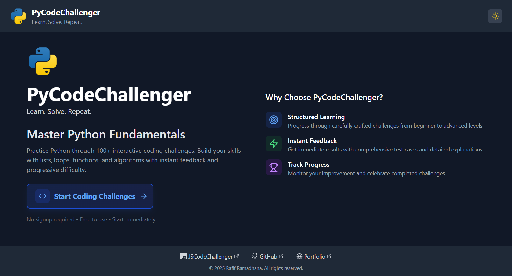
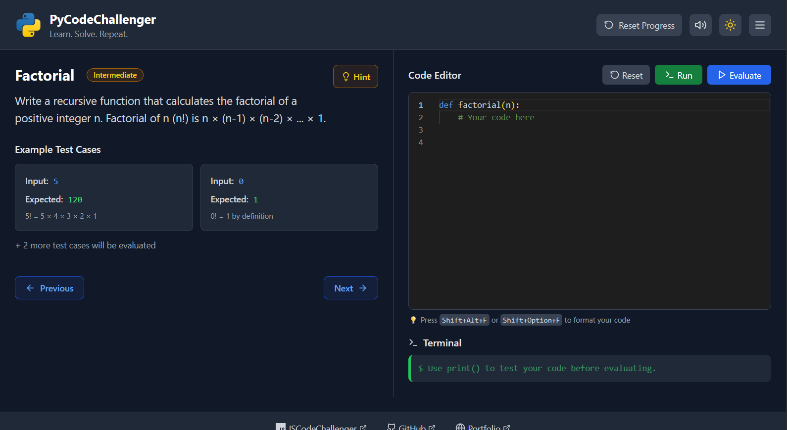

# PyCodeChallenger 🚀

**PyCodeChallenger** is a modern, interactive web application designed to help me and fellow Python developers master the fundamentals of Python through hands-on coding challenges. Built with **React**, **TypeScript**, and **Tailwind CSS**, this platform offers a smooth and responsive learning experience with Python code execution powered by **Pyodide**. It's **completely free**, requires **no sign-up**, and is perfect for practicing Python anytime, anywhere.



## ✨ Features

- **🎯 Structured Learning**: Progress through carefully crafted Python challenges from beginner to advanced levels
- **⚡ Instant Feedback**: Get immediate results with comprehensive test cases and detailed explanations
- **🐍 Real Python Execution**: Run actual Python code in the browser using Pyodide
- **🏆 Track Progress**: Monitor your improvement and celebrate completed challenges
- **🌙 Dark/Light Mode**: Toggle between themes for comfortable coding sessions
- **📱 Responsive Design**: Works seamlessly on desktop, tablet, and mobile devices
- **💾 Progress Persistence**: Your completed challenges are saved locally



## 🛠️ Tech Stack

- **Frontend**: React, TypeScript
- **Styling**: Tailwind CSS
- **Icons**: Lucide React
- **Build Tool**: Vite
- **Code Editor**: Monaco Editor (VS Code editor in the browser) with Python syntax highlighting
- **Python Runtime**: Pyodide (Python running in WebAssembly)
- **State Management**: React Hooks (useState, useEffect)

## 🚀 Getting Started

### Prerequisites

- Node.js (version 16 or higher)
- npm or yarn

### Installation

1. Clone the repository:
```bash
git clone https://github.com/rafiframadhana/py-code-challenger.git
cd py-code-challenger
```

2. Install dependencies:
```bash
npm install
```

3. Start the development server:
```bash
npm run dev
```

4. Open your browser and navigate to `http://localhost:5173`

## 📚 Challenge Categories

### Beginner Level
- **Arrays**: Array manipulation, iteration, and common methods
- **Functions**: Function declaration, parameters, and return values
- **Loops**: for, while, and do-while loops
- **Conditionals**: if/else statements and switch cases

### Intermediate Level
- **Objects**: Object creation, property access, and methods
- **String Manipulation**: String methods and pattern matching
- **Error Handling**: Try/catch blocks and error management

### Advanced Level
- **Recursion**: Recursive algorithms and problem-solving
- **Algorithms**: Sorting, searching, and optimization
- **Data Structures**: Working with complex data structures

## 🎮 How to Use

1. **Start Coding**: Click "Start Coding Challenges" on the landing page
2. **Choose a Challenge**: Select from the sidebar organized by difficulty and topic
3. **Write Your Code**: Use the built-in code editor to implement your solution
4. **Test Your Solution**: Run your code against test cases for instant feedback
5. **Track Progress**: Completed challenges are marked and saved automatically

## 🎨 Features in Detail

### Interactive Code Editor
- Syntax highlighting for JavaScript
- Auto-completion and IntelliSense
- Real-time error detection
- Resizable panels for optimal workflow

### Smart Progress Tracking
- Local storage persistence
- Visual indicators for completed challenges
- Progress reset functionality
- Challenge completion statistics

### Responsive Design
- Mobile-friendly interface
- Adaptive layouts for different screen sizes
- Touch-friendly controls

## 🔧 Development

### Available Scripts

- `npm run dev` - Start development server
- `npm run build` - Build for production
- `npm run preview` - Preview production build

## 🤝 Contributing

Contributions are welcome! Please feel free to submit a Pull Request. For major changes, please open an issue first to discuss what you would like to change.

1. Fork the repository
2. Create your feature branch (`git checkout -b feature/AmazingFeature`)
3. Commit your changes (`git commit -m 'Add some AmazingFeature'`)
4. Push to the branch (`git push origin feature/AmazingFeature`)
5. Open a Pull Request

## 📝 License

This project is licensed under the MIT License - see the [LICENSE](LICENSE) file for details.

## 👨‍💻 Author

**Rafif Ramadhana**
- GitHub: [@rafiframadhana](https://github.com/rafiframadhana)
- Portfolio: [rafiframadhana.site](https://rafiframadhana.site)
 
---

**Happy Coding! 🎉**
